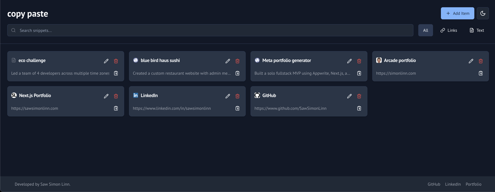

<p align="center">
  
</p>

<p align="center">
  
  
  
</p>

<h2 align="center">✨ CopyPaste ✨</h2>

<p align="center">
  **CopyPaste** revolutionizes how you manage your digital content by offering an intuitive and lightning-fast solution to instantly copy and save links and text. This powerful tool ensures that your favorite URLs, snippets, and important information are not just copied, but also meticulously organized and readily accessible whenever you need them. Experience unparalleled efficiency with a single click, transforming how you interact with web content and making content management effortless.
</p>

---

## 🔥 Features

- ⚡ Built with **Next.js, Tailwind CSS, TypeScript**
- ➕ **Instant Copying**: Quickly copy any link or text with a single click.
- 💾 **Seamless Saving**: Effortlessly save your favorite URLs and content for future reference.
- 🔍 **Organized Access**: Keep your saved items meticulously categorized for quick and easy retrieval.
- 🚀 **Lightning-Fast Performance**: Enjoy a smooth and responsive experience for all your copying and saving needs.
- 🎨 **Intuitive Design**: A clean, modern, and user-friendly interface for optimal usability.
- 📱 **Responsive Layout**: Access and manage your content seamlessly across all devices.

---

## 🚀 Live Demo

👉 [Visit The Website](https://copy-paste-amber.vercel.app/)

---

## 🛠️ Setup & Run

```bash
git clone https://github.com/SawSimonLinn/copyPaste
cd CopyPaste
npm install

npm run dev
```

---

## 💬 Feedback

Feel free to connect with me or drop feedback via [LinkedIn](https://www.linkedin.com/in/sawsimonlinn/). Let’s build something magical together! 💻✨

---

## 📄 License

This project is licensed under the MIT License.
